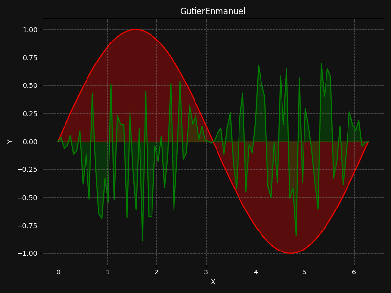

# Hi! Im Enmanuel¡ 👋

Welcome to my corner on GitHub! I'm Enmanuel Gutiérrez, a passionate data scientist and Python developer on the lookout for innovative solutions and exciting ML challenges.

  

## About Me

  🎓 Graduated in the art of analyzing data in 4Geeks and (trying to) writing clean, elegant code.  
  💡 Always on the hunt for new ideas and opportunities to learn and grow. 
  🔍 Seeking to join forces with curious minds passionate about technology.

## Skills

  💻 Python | Django | Streamlit | Jupyter Notebooks  
  📊 Data Analysis | Data Visualization | Machine Learning  
  🛠️ Git | GitHub | Docker  
  🔧 SQL | Keras | TensorFlow | Pandas | NumPy

## Contact

  📬 Interested in collaborating or just chatting about tech and data? Let's talk! 
  📧 Email: gutierenmanuel15@gmail.com  
  🔗 LinkedIn: https://www.linkedin.com/in/enmanuel-gutierrez-7b693b217/  
  🌐 Website: Coming soon! 

Thanks for visiting my profile! I hope you find something interesting around here. Contact me, Let's build something awesome together!

